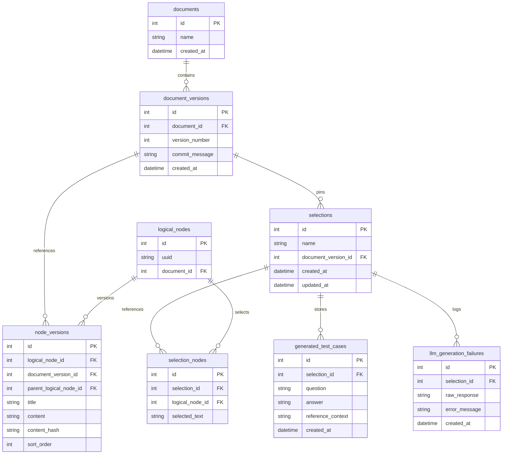
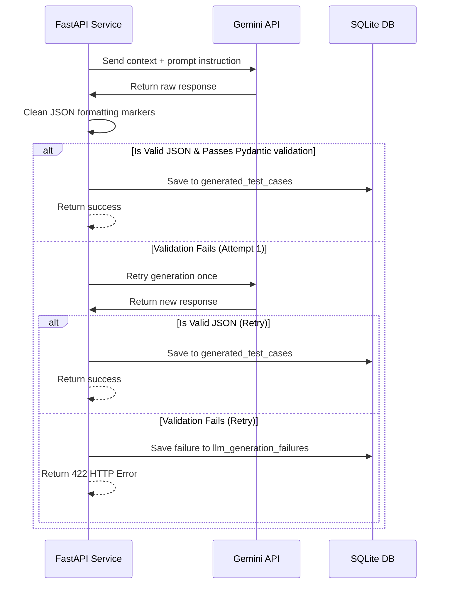

# Tri9T Engineering Approach & System Design Document

This document provides a comprehensive overview of the design patterns, architectural layers, data schemas, parsing algorithms, LLM integrations, and versioning strategies implemented in this repository.

---

## 1. System Architecture

The project is built on **Clean Architecture** principles, separating concerns into discrete, decoupled layers to ensure testability, simple maintenance, and modularity.

```
┌────────────────────────────────────────────────────────┐
│                      FastAPI API                       │
│     (endpoints, routers, request/response schemas)     │
└───────────────────────────┬────────────────────────────┘
                            │ (Uses DI / db_session)
                            ▼
┌────────────────────────────────────────────────────────┐
│                     Service Layer                      │
│   (pdf_parser, versioning, llm_generation, retrieval)  │
└───────────────────────────┬────────────────────────────┘
                            │ (Queries via SQLAlchemy/Motor)
                            ▼
┌────────────────────────────────────────────────────────┐
│                   Persistence Layer                    │
│     (SQLAlchemy Base Models, Motor Mongo Client)       │
└────────────────────────────────────────────────────────┘
```

### Architectural Layers
1. **API / Routing Layer (`app/api/v1/endpoints/`)**: Defines FastAPI endpoints, validates parameters, and returns Pydantic response models.
2. **Service Layer (`app/services/`)**: Orchestrates business logic and pipelines (PDF parsing, tree reconstruction, version matching, LLM prompt engineering, and traceability).
3. **Data / Persistence Layer (`app/models/` and `app/repositories/`)**: Manages SQLite/SQLAlchemy schemas (anchoring logical nodes, selection sets, and test cases) and handles NoSQL metadata storage via MongoDB and Motor.
4. **Configuration / Core (`app/core/`)**: Manages environments, SQLite connection pooling (`aiosqlite`), and logger targets.

---

## 2. Relational Database Schema

The SQLite schema supports versioned documents, immutable selection sets, generated test cases, and audit trails.



### Logical Node Identity
*   `logical_nodes` acts as a stable database anchor. When a document is re-ingested with updates, unchanged nodes point to their original `LogicalNode` but get a new row in `node_versions` mapped to the new `document_versions.id`.

---

## 3. PDF Parsing & Hierarchy Reconstruction

The parsing pipeline is divided into five modular stages coordinated by `PDFParsingPipeline`:

```
[PDF File] ──► [PDFReader] ──► [TableDetector] ──► [LayoutAnalyzer] ──► [BlockClassifier] ──► [HierarchyBuilder]
```

### Component Details
1.  **`PDFReader`**: Extracts digital text page-by-page. If a page has zero digital characters, it automatically renders a high-DPI (150 DPI) image of the page and runs OCR via **Tesseract OCR** (`pytesseract`).
2.  **`TableDetector`**: Extracts tabular sections using PyMuPDF bounding boxes. It filters out duplicate sub-tables and nested boxes, formatting rows into clean structured Markdown grids.
3.  **`LayoutAnalyzer`**: Merges text blocks and tables. It excludes text blocks whose area is over 50% contained within a table bounding box, preventing cell contents from being extracted twice. Remaining items are sorted top-to-bottom.
4.  **`BlockClassifier`**: Classifies raw elements using strict regex validators into headings (nested section levels e.g. `2.1.1.1`), lists, tables, or paragraphs.
5.  **`HierarchyBuilder`**: 
    *   Merges paragraph splits across page boundaries (e.g. sentences starting with a lowercase letter or hyphen).
    *   Groups consecutive list items into a single Markdown block.
    *   Builds a nested tree structure using an ancestor path tracking stack based on heading levels.

---

## 4. Parser Edge Cases & Mitigations

| Edge Case | Problem | Mitigation Strategy |
| :--- | :--- | :--- |
| **Missing intermediate headings** | A node labeled `3.4.1` appears but parent `3.4` does not exist. | Emitter raises a `Hierarchy mismatch` warning. The node is gracefully nested under the longest existing prefix (e.g., `3.0` or root). |
| **Level jumps** | An H1 heading is followed directly by an H3 heading. | A warning is raised. The node is nested under the active ancestor stack to prevent data loss. |
| **Page break split paragraphs** | Paragraphs split across page bounds look like separate blocks. | Merges consecutive blocks sharing coordinates and lacking trailing punctuation, or starting with lowercase characters. |
| **Duplicate headings** | Two headings in the same section have identical titles. | Detects duplicate keys and appends `_dup[count]` to ensure uniqueness in logical node signatures. |
| **Text duplication in tables** | Table text is extracted both as table cells and as raw text blocks. | LayoutAnalyzer removes any text block whose center or >50% bounding area falls within a table box. |

---

## 5. Document Versioning & Matching Strategy

To compare two versions of a document ($V_1$ and $V_2$) and categorize nodes as **unchanged**, **modified**, **added**, or **removed**, we map incoming elements to existing `logical_nodes`.

### Stable Logical Node Matching
During ingestion of $V_2$:
1.  Generate a structural signature path for each node (e.g. `heading:2 > heading:2.1 > paragraph:1`).
2.  Compare against the signature path map of the previous version ($V_1$).
3.  If a match is found, associate the new `NodeVersion` with the existing `LogicalNode` ID. If not, create a new `LogicalNode`.

### Change Classification Rules
For matched node versions:

| Scenario | Path Match | Content Hash Match | Category | Description |
| :--- | :--- | :--- | :--- | :--- |
| **$N_1$ and $N_2$ exist** | Same | Same | **Unchanged** | No edit, no move. |
| **$N_1$ and $N_2$ exist** | Different | Same | **Unchanged (Moved)** | The content is identical, but the node was moved. |
| **$N_1$ and $N_2$ exist** | Any | Different | **Modified** | The text or data content changed. |
| **$N_1$ absent, $N_2$ exists** | N/A | N/A | **Added** | A brand new structural or leaf element. |
| **$N_1$ exists, $N_2$ absent** | N/A | N/A | **Removed** | An old node deleted in the new version. |

---

## 6. Stale Traceability Detection

Generated test cases reference selections pinned to a specific document version. When a newer version is uploaded, selection validity is computed as follows:

```
Selection Nodes
   ├── All nodes exist in Target Version & Hashes Match ───────► STATUS: Fresh
   ├── All nodes exist in Target Version & Hashes Changed ─────► STATUS: Possibly Stale
   └── One or more nodes deleted in Target Version ────────────► STATUS: Stale
```

### Limitations of Hash-Based Traceability
1.  **False Positives (Cosmetic Changes)**: Byte-level shifts (fixing typos, punctuation, spacing) alter the content hash, flagging the QA as "Possibly stale" even if the semantics are unchanged.
2.  **False Negatives (Context Reordering)**: If a node is moved to a completely different context but its text remains identical, the hash is unchanged. The status reports "Fresh" despite potential context contradictions.
3.  **Dependency Blindness**: If parent or sibling text changes significantly but the selected node remains identical, the selection remains "Fresh" despite structural context changes.

---

## 7. LLM Integration & Structured Output

QA generation processes selections through a prompt pipeline to generate test cases:

### Prompt Design
*   **Role**: Senior QA Test Engineer.
*   **Context**: Reconstructed selected text and its parent structural headings.
*   **Action**: Generate 3-5 QA test cases directly based on selected text.
*   **Output Constraint**: Return strictly a valid JSON object matching the requested schema.

### Structured Validation & Retry Strategy



If validation fails after retry, the system stores the raw response and error message in the `llm_generation_failures` table for debugging purposes, returning a helpful HTTP `422 Unprocessable Entity` error.

---

## 8. Decision Log

### 1. How does the system handle structural changes between versions?
*   **Decision**: Maintain logical node identity via signature paths (`parent_key` structure combined with type counters).
*   **Rationale**: Tied comparison to stable logical nodes and their parent paths instead of flat, index-based line comparisons. This ensures that inserting a paragraph at the top of a document does not shift all downstream nodes, maintaining clean trace history.

### 2. Why was SQLite and SQL Schema chosen?
*   **Decision**: SQLite with SQLAlchemy Async (`aiosqlite`) was chosen as the primary relational database.
*   **Rationale**: The relational nature of document versioning (mapping versions to selections, selections to nodes, and nodes to test cases) fits perfectly in a SQL schema. SQLite requires zero external server setup, making local development and testing self-contained and highly reproducible. MongoDB is integrated in parallel as a secondary store for raw document layouts.

### 3. How is LLM integration validation structured?
*   **Decision**: Clean markdown wrappers, load JSON, validate against a strict Pydantic model (`QAGenerationResponse`), and use a single-retry recovery path.
*   **Rationale**: LLM responses can occasionally contain markdown ticks or structural anomalies. The dual-attempt validation pipeline ensures that API consumers receive strictly typed objects, while persistent failures are logged in a dedicated table for audit.

---

## 9. Future Improvements

1.  **Semantic Similarity Analysis (embeddings)**: Compute cosine similarity between source and target text embeddings. If the similarity is above a threshold (e.g., `0.98`), the change is classified as cosmetic, reducing false-positive staleness reports.
2.  **AST / Hierarchy Path Tracking**: Incorporate the node's reconstructed hierarchy path into the hash check so that structural reordering shifts status to `Possibly stale`.
3.  **LLM-Assisted Auto-Repair**: Create a pipeline where `Possibly stale` test cases are automatically re-written by an LLM to align with the new text.
