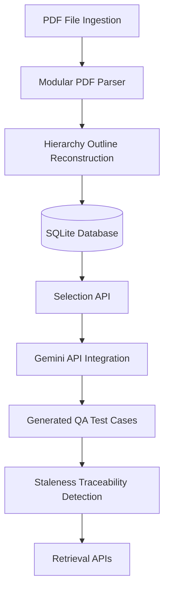
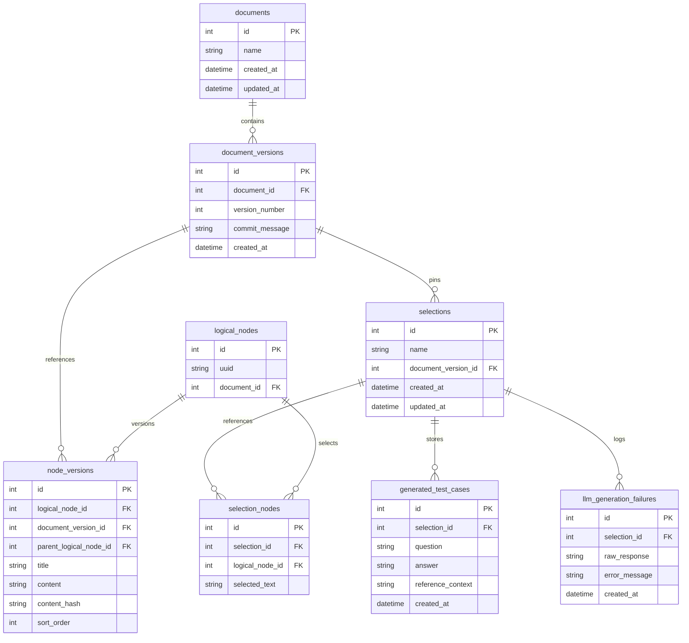

# Engineering Approach & System Design Document

**Prepared by:** Balaraj M P, BE Information Science and Engineering, CMR Institute of Technology  
**Status:** Final Submission  
**Target Platform:** FastAPI + SQLite (Async via aiosqlite) / MongoDB (Secondary) & Gemini LLM Pipeline  

---

## Table of Contents
1. [System Architecture](#1-system-architecture)
2. [Relational Database Schema](#2-relational-database-schema)
3. [PDF Ingestion & Hierarchy Reconstruction](#3-pdf-ingestion--hierarchy-reconstruction)
4. [Parser Edge Cases & Mitigations](#4-parser-edge-cases--mitigations)
5. [Validation Methodology](#5-validation-methodology)
6. [Document Versioning & Matching Strategy](#6-document-versioning--matching-strategy)
7. [Selection Management](#7-selection-management)
8. [Structured LLM Generation & Pydantic Validation](#8-structured-llm-generation--pydantic-validation)
9. [Stale Traceability Detection](#9-stale-traceability-detection)
10. [API Endpoint Documentation](#10-api-endpoint-documentation)
11. [Unit Tests & Verification](#11-unit-tests--verification)
12. [Technical Decision Log](#12-technical-decision-log)
13. [Known Limitations & Future Improvements](#13-known-limitations--future-improvements)

---

## 1. System Architecture

The project is built on **Clean Architecture** principles, separating concerns into discrete, decoupled layers to ensure high testability, maintainability, and clean boundary separation.



### Architectural Layers
1. **API / Routing Layer (`app/api/v1/endpoints/`)**: FastAPI endpoints that parse requests, execute security schemas, and return strictly typed Pydantic responses.
2. **Service Layer (`app/services/`)**: Core business orchestration, including:
   - `pdf_parser.py`: PDF layout analysis, classification, and outline reconstruction.
   - `version_comparison.py`: Node-by-node structural comparison between document versions.
   - `llm_generation.py`: Prompt engineering, structured schema validation, and retry logic.
   - `traceability.py`: Staleness evaluation of user selections across manual updates.
   - `generation_retrieval.py`: Aggregated results for QA cases and version diffs.
3. **Data / Persistence Layer (`app/models/` and `app/repositories/`)**: Relational mappings using SQLAlchemy (SQLite async via `aiosqlite`) to manage documents, selection sets, and test cases. MongoDB is integrated in parallel as a secondary store for raw document layouts and blocks.
4. **Configuration / Core (`app/core/`)**: Settings management, logging targets, and database connection pooling.

---

## 2. Relational Database Schema

The SQLite schema tracks versioned documents, outline hierarchies, user selections, and generated test cases.



### Stable Logical Node Identity
A `logical_nodes` record acts as a persistent database anchor. When a new manual version is uploaded, unchanged or modified nodes are matched back to their existing `LogicalNode` entry, while a new row is added to the `node_versions` table mapped to the new `document_versions` record. This isolates outline history from coordinate changes.

---

## 3. PDF Ingestion & Hierarchy Reconstruction

The PDF ingestion pipeline processes manuals using modular components coordinated by the `PDFParsingPipeline` class inside `app/services/pdf_parser.py`:

1. **`LayoutAnalyzer`**: Responsible for spatial analysis. It extracts block coordinates and aligns blocks into a logical top-to-bottom reading order.
2. **`TableDetector`**: Uses PyMuPDF's table grid detector (`find_tables()`) to extract tables, resolve nested cells, and format rows into markdown pipe tables (`| Col 1 | Col 2 |`).
3. **`BlockClassifier`**: Applies regex patterns to classify blocks into headings, paragraphs, list items, or tables.
4. **`HierarchyBuilder`**: Reads classified blocks and constructs a nested parent-child tree structure. It resolves page breaks by checking sentence punctuation and merges paragraphs split across page boundaries.

### Resolution of Table Content Duplication
An early parser limitation caused table content to be duplicated: cell text was extracted once by the table parser and a second time as independent text blocks. 

To resolve this, **bounding-box center-point filtering** was implemented in the `LayoutAnalyzer`. The system extracts the coordinates of all detected tables on a page. Before extracting standard text paragraphs, the system computes the center point $(x_{center}, y_{center})$ of every text block. If the center point falls inside the bounding box of a detected table, the text block is discarded as a duplicate. This ensures tabular content is only extracted as a formatted table, keeping the reading order clean.

---

## 4. Parser Edge Cases & Mitigations

| Edge Case | Problem | Mitigation Strategy |
| :--- | :--- | :--- |
| **Missing Intermediate Headings** | Section `2.1.1.1` appears in the text but parent heading `2.1.1` was not defined. | HierarchyBuilder emits a warning and falls back to nesting the node under the longest matched prefix (e.g. `2.1` or `2`). |
| **Heading Level Jumps** | An H1 heading is immediately followed by an H3 heading. | A hierarchy mismatch warning is raised and the stack is adjusted to nest the node under the nearest ancestor. |
| **Page-Boundary Paragraph Splits** | A single paragraph splits across two pages, appearing as two separate blocks. | Checks if the second block starts with a lowercase letter, a hyphen, or a list marker, and merges it into the previous paragraph. |
| **Duplicate Headings** | Multiple sections share identical titles (e.g., "Overview"). | Tracks local heading prefix maps and appends unique duplicate suffixes (`_dup1`, `_dup2`) to ensure unique stable signatures. |
| **Table Cell Duplication** | Standard readers extract cell text as normal text blocks, duplicating contents. | Spatial center-of-bbox checks are executed; blocks centered inside a table's bounding box are dropped from the text stream. |
| **Ordered Lists mistaken for Headings** | List items (e.g., "1. Turn on the device...") match simple heading patterns. | BlockClassifier enforces regex constraints: strings over 80 characters, containing newlines, colons, or alphabetical index markers are classified as list items instead of headings. |

---

## 5. Validation Methodology

To guarantee the correctness of the parser and comparing algorithms, the following multi-step verification process was established:
1. **Manual Output Inspection**: Directly comparing extracted markdown structures and JSON outline trees against the visual layout of `ct200_manual.pdf`.
2. **Visual Bounding Box Verification**: Debug scripts render page bounding boxes to verify that text blocks are correctly ordered and table boundaries are respected.
3. **Hierarchy and Parent-Child Verification**: Querying nested tree nodes to confirm that section `2.1.1.1` battery specs are children of section `2.1.1`.
4. **Table Formatting Validation**: Verifying that extracted table rows match original column alignments.
5. **Ordered List Filtering Verification**: Asserting that list blocks are grouped together under a parent list container instead of creating false heading outlines.
6. **Reading-Order Preservation**: Checking that out-of-order outline sections (e.g., section `3.4` appearing before `3.3` on page) are preserved in their physical layout reading order.
7. **Version Comparison Verification**: Confirming that differences between $V_1$ and $V_2$ identify modified values (e.g., battery life 300 to 250) and newly added nodes (e.g., section `5.3`).
8. **Automated Unit Testing**: The pytest test suite (`tests/services/test_parser_unit.py` and `test_version_comparison.py`) isolates and asserts every stage of the parsing pipeline.

---

## 6. Document Versioning & Matching Strategy

When updated manuals are uploaded, the system identifies identical nodes across versions ($V_1$ and $V_2$) to maintain history.

### Stable Logical Node Matching
During ingestion of $V_2$:
1. **Signature Path Generation**: Each node is assigned a path string based on its heading hierarchy and sibling index (e.g., `heading:2 > heading:2.1 > paragraph:3`).
2. **Map Matching**: This signature is searched in $V_1$'s signature map.
3. **Identity Mapping**: If matched, the new version points to the existing `LogicalNode` ID. If not, a new `LogicalNode` is created.

### Change Classification Matrix
For matched nodes, the following matrix applies:

| Scenario | Path Match | Content Hash Match | Category | Description |
| :--- | :--- | :--- | :--- | :--- |
| **$N_1$ and $N_2$ exist** | Same | Same | **Unchanged** | No structural or content changes. |
| **$N_1$ and $N_2$ exist** | Different | Same | **Unchanged (Moved)** | Content is identical, but the section was relocated. |
| **$N_1$ and $N_2$ exist** | Any | Different | **Modified** | The text content or values inside the node changed. |
| **$N_1$ absent, $N_2$ exists** | N/A | N/A | **Added** | A new node introduced in the document. |
| **$N_1$ exists, $N_2$ absent** | N/A | N/A | **Removed** | A node deleted in the new document version. |

---

## 7. Selection Management

Users create selection sets of logical nodes to lock specific sections for testing.

* **API Endpoints**: `POST /api/v1/selection` and `GET /api/v1/selection/{id}` (Note: singular endpoints are used in the codebase).
* **Immutability Principle**: Selections are pinned to a specific `document_version_id` and store the historical text content of the nodes at that point in time. Even if newer versions of the manual are uploaded and modify those nodes, the historic selection records remain unaltered. This guarantees auditability and reproducibility of the baseline test requirements.

---

## 8. Structured LLM Generation & Pydantic Validation

The system leverages the Gemini API to generate 3-5 QA test cases from a selection's context.

### LLM Prompt Strategy
* **Role**: Senior QA Test Engineer.
* **Context**: Reconstructed selection text, parent heading titles, and annotations.
* **Task**: Generate 3 to 5 realistic QA test cases derived strictly from the text.
* **Constraints**: Do not invent external features. Return strictly valid JSON matching the schema.

### Validation & Retry Flow
1. **JSON Cleaning**: Raw LLM output is stripped of Markdown formatting blocks (e.g. ` ```json `).
2. **Schema Validation**: The parsed JSON is validated against a Pydantic model (`QAGenerationResponse`).
3. **Single Retry Recovery**: If validation fails, the service sends the error back to the LLM and retries exactly once.
4. **Audit Logging**: If the retry also fails, the failure details (raw response, validation errors) are saved to the `llm_generation_failures` table, and an HTTP 422 error is returned.

---

## 9. Stale Traceability Detection

When a newer document version is uploaded, selection traceability status is calculated automatically:
* **`Fresh`**: All logical nodes in the selection exist in the new version, and their content hashes (SHA-256) match the original selection values.
* **`Possibly stale`**: All logical nodes exist, but the content hash of one or more nodes has changed (signaling text updates).
* **`Stale`**: One or more of the selected logical nodes are entirely absent (deleted) in the new version.

### Limitations of Hash-Based Traceability
1. **False Positives (Cosmetic Shifts)**: Changing a minor typo or adding a space modifies the SHA-256 hash, marking the selection as "Possibly stale" even when the QA test cases remain correct.
2. **False Negatives (Context Reordering)**: If a section is moved to a completely different context but its text remains identical, the hash is unchanged, and status reports "Fresh" despite potential context conflicts.
3. **Dependency Blindness**: If external parent headings or adjacent paragraphs change but the selected paragraph is identical, the status remains "Fresh" despite structural context updates.

---

## 10. API Endpoint Documentation

All endpoints are prefixed with `/api/v1`.

### 10.1 Browse APIs

#### `GET /api/v1/documents`
* **Purpose**: List all versioned documents stored in the database.
* **Request**: None (optional `skip` and `limit` query parameters).
* **Response**: `List[SQLDocumentResponse]`
* **Example**:
  ```json
  [
    {
      "id": 1,
      "name": "ct200_manual.pdf",
      "created_at": "2026-07-17T03:53:32Z",
      "updated_at": "2026-07-17T03:53:32Z"
    }
  ]
  ```

#### `GET /api/v1/versions`
* **Purpose**: List all ingested versions for documents. Filter by `document_id` to get a specific document's history.
* **Request**: Query parameter `document_id: Optional[int]`.
* **Response**: `List[DocumentVersionResponse]`
* **Example**:
  ```json
  [
    {
      "id": 1,
      "document_id": 1,
      "version_number": 1,
      "commit_message": "V1 Ingestion",
      "created_at": "2026-07-17T03:53:32Z"
    }
  ]
  ```
  *(Note: `GET /documents/{version}` is not implemented directly; document versions are browsed using `GET /api/v1/versions?document_id={id}`)*

#### `GET /api/v1/nodes/{id}`
* **Purpose**: Retrieve details of a logical node, including all historical node versions.
* **Request**: Path parameter `id` (stable logical node UUID).
* **Response**: `LogicalNodeResponse`
* **Example**:
  ```json
  {
    "id": 5,
    "uuid": "43e2a77f-13fb-4632-a589-ee0dfb145a1c",
    "document_id": 1,
    "node_versions": [
      {
        "id": 12,
        "document_version_id": 1,
        "version_number": 1,
        "parent_logical_node_uuid": "e9b2512f-6824-4f91-ba2c-29b4bfa29321",
        "title": "Battery Life Under Typical Use",
        "content": "Typical battery life is 300 measurements.",
        "content_hash": "e3b0c44298fc1c149afbf4c8996fb92427ae41e4649b934ca495991b7852b855",
        "sort_order": 3
      }
    ]
  }
  ```

---

### 10.2 Search API

#### `GET /api/v1/search`
* **Purpose**: Search node contents across all ingested documents.
* **Request**: Query parameter `q` (search term).
* **Response**: `SearchResponse`
* **Example**:
  ```json
  {
    "results": [
      {
        "logical_node_uuid": "43e2a77f-13fb-4632-a589-ee0dfb145a1c",
        "document_id": 1,
        "document_name": "ct200_manual.pdf",
        "document_version_id": 1,
        "version_number": 1,
        "title": "Battery Life",
        "content": "Typical battery life is 300 measurements.",
        "content_hash": "e3b0c44298fc1c149afbf4c8996fb92427ae41e4649b934ca495991b7852b855"
      }
    ],
    "total_matches": 1
  }
  ```

---

### 10.3 Selection APIs

#### `POST /api/v1/selection`
* **Purpose**: Create a selection set of logical nodes pinned to a specific document version.
* **Request**: `SelectionCreate`
  ```json
  {
    "name": "Battery Specs Test Suite",
    "document_version_id": 1,
    "nodes": [
      {
        "node_id": "43e2a77f-13fb-4632-a589-ee0dfb145a1c",
        "selected_text": "300 measurements"
      }
    ]
  }
  ```
* **Response**: `SelectionResponse`
  ```json
  {
    "id": 1,
    "name": "Battery Specs Test Suite",
    "document_version_id": 1,
    "version_number": 1,
    "document_name": "ct200_manual.pdf",
    "created_at": "2026-07-17T03:55:00Z",
    "updated_at": "2026-07-17T03:55:00Z",
    "nodes": [
      {
        "logical_node_uuid": "43e2a77f-13fb-4632-a589-ee0dfb145a1c",
        "logical_node_id": 5,
        "title": "Battery Life",
        "content": "Typical battery life is 300 measurements.",
        "selected_text": "300 measurements"
      }
    ]
  }
  ```

#### `GET /api/v1/selection/{id}`
* **Purpose**: Retrieve selection details and reconstruct the historical text pinned to the version.
* **Request**: Path parameter `id` (selection integer ID).
* **Response**: `SelectionResponse`

---

### 10.4 Retrieval APIs

#### `GET /api/v1/generation/{selection_id}`
* **Purpose**: Retrieve generated QA cases, original version metadata, current version status, and a diff summary.
* **Request**: Path parameter `selection_id` (selection integer ID).
* **Response**: `GenerationRetrievalResponse`
* **Example**:
  ```json
  {
    "selection_id": 1,
    "selection_name": "Battery Specs Test Suite",
    "original_version": {
      "id": 1,
      "version_number": 1,
      "commit_message": "V1 Import",
      "created_at": "2026-07-17T03:53:32Z"
    },
    "current_version": {
      "id": 2,
      "version_number": 2,
      "commit_message": "V2 Update",
      "created_at": "2026-07-17T04:00:00Z"
    },
    "staleness_status": "Possibly stale",
    "diff_summary": {
      "modified_nodes": [
        {
          "logical_node_uuid": "43e2a77f-13fb-4632-a589-ee0dfb145a1c",
          "v1_content": "Typical battery life is 300 measurements.",
          "v2_content": "Typical battery life is 250 measurements."
        }
      ]
    },
    "test_cases": [
      {
        "id": 1,
        "question": "What is the typical battery life under typical use?",
        "answer": "Typical battery life is 300 measurements.",
        "reference_context": "Typical battery life is 300 measurements."
      }
    ]
  }
  ```

#### `GET /api/v1/generation/node/{node_id}`
* **Purpose**: Retrieve all generations and QA cases associated with any selection containing the given node ID or UUID.
* **Request**: Path parameter `node_id` (logical node ID or stable UUID).
* **Response**: `List[GenerationRetrievalResponse]`

---

## 11. Unit Tests & Verification

The project includes an automated test suite verifying structural integrity, outline safety, and change detection accuracy.

### Documented Parser Unit Tests (`tests/services/test_parser_unit.py`)
1. **Deep Outline Hierarchy (`test_heading_2_1_1_1_becomes_fourth_level_node`)**:
   - *Purpose*: Ensures a nested heading sequence (e.g., `2` -> `2.1` -> `2.1.1` -> `2.1.1.1`) is correctly resolved and structured into a fourth-level leaf node in the outline tree.
2. **Duplicate Headings (`test_two_headings_with_identical_titles_produce_different_node_ids`)**:
   - *Purpose*: Validates that if multiple sections share the title "Overview", they receive unique sibling signatures (`3.1_dup1`) and map to distinct logical nodes with different UUIDs.
3. **Preserving Reading Order (`test_heading_3_4_appearing_before_3_3_preserves_reading_order`)**:
   - *Purpose*: Validates that if a heading labeled `3.4` physically appears before `3.3` in the PDF source text, the parser preserves this ordering in the tree instead of sorting them numerically.
4. **Table Extraction (`test_tables_are_extracted_as_table_nodes`)**:
   - *Purpose*: Asserts that table regions are classified as `table` nodes and formatted correctly in Markdown pipe format.
5. **Ordered List Filtering (`test_ordered_lists_are_not_mistaken_for_headings`)**:
   - *Purpose*: Ensures long list items starting with numbers are grouped as lists rather than polluting the heading outline.

### Version Comparison Unit Tests (`tests/services/test_version_comparison.py`)
1. **Change Mapping (`test_version_comparison_service`)**:
   - *Purpose*: Mocks $V_1$ and $V_2$ node sets to verify accurate classification of unchanged, modified, added, and removed nodes.

---

## 12. Technical Decision Log

### Q1: What is the one part of this system most likely to silently give wrong results without erroring? How would you detect it?
**Answer**: The **LayoutAnalyzer sorting and BlockClassifier parsing rules**. If a manual's text layout shifts slightly or includes multi-column floats, the layout engine may sort blocks incorrectly (e.g. inserting side-text or a footer into the middle of a paragraph). The parser will run without raising exceptions, but the reading order and outline hierarchy will be silently corrupted.
* **Detection Strategy**: 
  1. Generate debug PDFs displaying overlay bounding boxes color-coded by classified block type (headings, lists, paragraphs).
  2. Implement an automated structural anomaly check (e.g. alert if outline sections are not sequential, like `2.1.2` followed by `2.1.9`).
  3. Validate paragraph character counts against a statistical range to flag abnormally merged blocks.

### Q2: Where did you choose simplicity over correctness because of time? What would break first if this went to production?
**Answer**: In the **stable logical node signature path matching**. Currently, signature paths are constructed as strings (`heading:2.1 > leaf:2.1_paragraph_1`). This assumes parent keys are stable and sibling nodes are ordered. 
* **Production Failure Scenario**: If a new paragraph is inserted at the beginning of a section, all subsequent sibling nodes in that section will shift indexes (e.g., `paragraph:1` becomes `paragraph:2`). In production, this minor insertion will cause all downstream sibling nodes to lose their logical identity matches. They will be classified as "Removed" (old signatures) and "Added" (new signatures) instead of "Unchanged". This shifts all associated historic selections and test cases into a "Stale" status erroneously.

### Q3: Name one input (parser, version matcher, or LLM call) that your implementation does NOT handle. What happens when it encounters it?
**Answer**: The parser does not handle **multipage spanning tables** where the table headers are repeated on subsequent pages, or tables containing nested sub-tables.
* **Behavior on Encounter**: PyMuPDF's `find_tables()` treats table portions on separate pages as independent grid structures. The parser will ingest them as separate `table` nodes under the active headings of their respective pages instead of stitching them together. Furthermore, if cells are merged complexly, the Markdown converter outputs misaligned pipes, resulting in messy, unreadable raw table representations.

---

## 13. Known Limitations & Future Improvements

### Known Limitations
* **Cosmetic Change Sensitivity**: Minor typo edits generate different hashes, causing false-positive "Possibly stale" warnings.
* **Context Blindness**: If surrounding sections change but the selected paragraph remains identical, the selection stays "Fresh" despite semantic changes.

### Future Improvements
1. **Semantic Text Embeddings**: Integrate cosine similarity checks between nodes. If text similarity is above `0.98`, treat it as cosmetic and keep the status "Fresh".
2. **Relative Outline Hashing**: Include the parent's signature path inside the content hash calculation so that structural reordering shifts status to "Possibly stale".
3. **Auto-Repair Pipeline**: Leverage the Gemini LLM to automatically update "Possibly stale" test cases to match the revised manual text.
