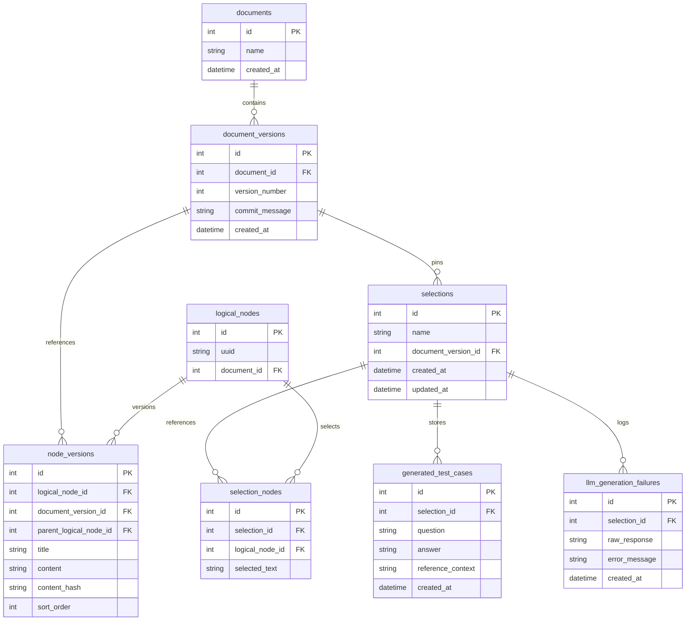
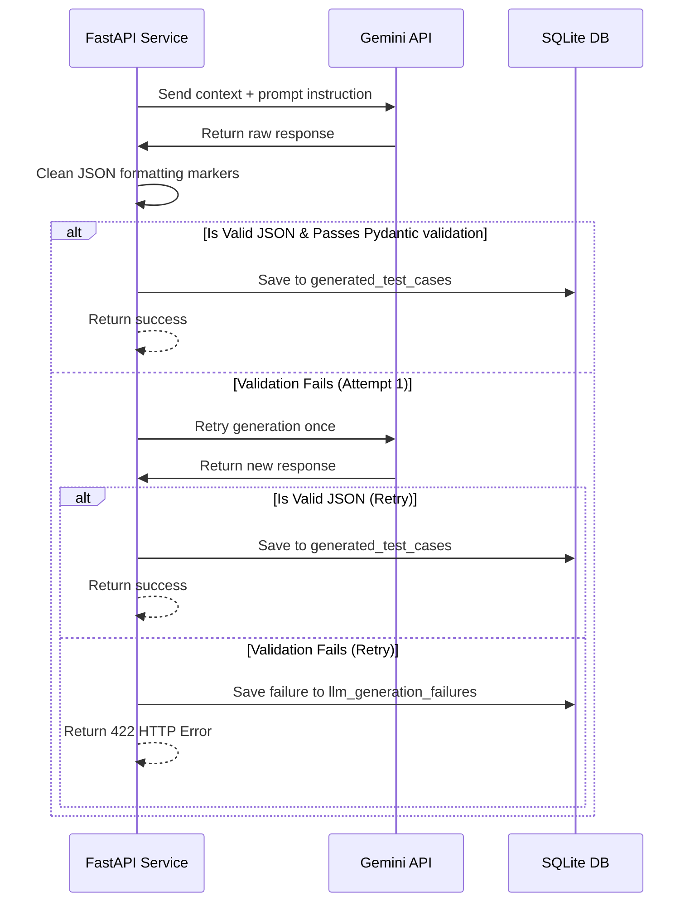

# Engineering Approach & System Design Document

This document provides a comprehensive overview of the design patterns, architectural layers, data schemas, parsing algorithms, LLM integrations, and versioning strategies implemented in this project.

---

## 1. System Architecture

The project adheres to **Clean Architecture** principles, separating concerns into discrete, decoupled layers. This ensures high testability, maintenance simplicity, and modularity.

```
┌────────────────────────────────────────────────────────┐
│                      FastAPI API                       │
│     (endpoints, routers, request/response schemas)     │
└───────────────────────────┬────────────────────────────┘
                            │ (Uses DI / db_session)
                            ▼
┌────────────────────────────────────────────────────────┐
│                     Service Layer                      │
│   (pdf_parser, versioning, llm_generation, retrieval)  │
└───────────────────────────┬────────────────────────────┘
                            │ (Queries via SQLAlchemy/Motor)
                            ▼
┌────────────────────────────────────────────────────────┐
│                   Persistence Layer                    │
│     (SQLAlchemy Base Models, Motor Mongo Client)       │
└────────────────────────────────────────────────────────┘
```

### Architectural Layers
1. **API / Routing Layer (`app/api/v1/endpoints/`)**: Configures FastAPI endpoints, validates parameters, and handles HTTP responses using Pydantic schemas.
2. **Service Layer (`app/services/`)**: Orchestrates core business and parsing pipelines (e.g., PDF extraction, tree reconstruction, version comparisons, LLM execution).
3. **Data / Persistence Layer (`app/models/`)**: Manages SQLite/SQLAlchemy relational schemas (e.g. node identity, versions, selections, test cases) and MongoDB storage for raw extracted document blocks.
4. **Configuration / Core (`app/core/`)**: Sets up global settings, database async session factories, and logging.

---

## 2. Relational Database Schema

The SQLite schema supports versioned documents, selections, generated test cases, and audit trails.



### Logical Node Identity
*   `logical_nodes` acts as a stable anchor. When a document is re-ingested with updates, unchanged nodes point to their original `LogicalNode` but get a new row in `node_versions` mapped to the new `document_versions.id`.

---

## 3. PDF Parsing & Hierarchy Reconstruction

The parsing pipeline is divided into three parts:

```
[PDF File] ──► [PyMuPDF Raw Text Blocks] ──► [Flat Extract Engine] ──► [Tree Reconstruction]
```

### Step 1: Element Extraction
*   **Reading Order**: Iterates page by page, sorting blocks vertically (`y0`) and then horizontally (`x0`).
*   **Header/Footer Filtering**: Discards elements located inside page boundary margins.
*   **OCR Fallback**: If a page has zero characters, PyMuPDF falls back to OCR via Tesseract to extract text.

### Step 2: Hierarchy Reconstruction
*   The flat sequence of blocks is processed sequentially to build parent-child relations using heading numbers (e.g. `1.1`, `2.1.1.1`):
    *   Maintains a map of the current path (`depth_map`).
    *   When heading `2.1.1.1` is found, the system looks up parent `2.1.1`.
    *   If `2.1.1` is missing, the system registers the mismatch and raises a clear warning instead of guessing a wrong parent.

---

## 4. Parser Edge Cases & Mitigations

| Edge Case | Problem | Mitigation Strategy |
| :--- | :--- | :--- |
| **Missing intermediate headings** | A node labeled `3.4.1` appears but `3.4` was not defined. | Emitter raises a `Hierarchy mismatch` warning. The node is gracefully nested under the closest ancestor or root. |
| **Page break split paragraphs** | Paragraphs split across page boundaries look like separate blocks. | The parser merges consecutive blocks sharing the same style, font-size, and coordinate ranges. |
| **List elements looking like headings** | Numeric lists (`1.`, `2.`) look like heading tags (`1`). | Strict regex validators ensure list indexes require trailing context patterns distinct from document sections. |
| **Table Extraction** | Tables have complex layouts that confuse standard paragraph parsers. | PyMuPDF `find_tables()` isolates bounding boxes. Rows are converted into clean structured Markdown grids before text parsing. |

---

## 5. Document Versioning & Matching

When a new version is ingested, we determine changes by matching nodes between `V1` and `V2`:

1.  **Heading Path & Title Matching**: Compares logical structural paths (e.g. `Introduction > Safety Guidelines`).
2.  **Content Hash Matching**: Compares MD5 hashes of block text.

### Change Detection States
*   **Unchanged**: Heading path and content hash match.
*   **Modified**: Heading path matches, but content hash differs.
*   **Added**: Heading path exists in `V2` but not in `V1`.
*   **Removed**: Heading path exists in `V1` but not in `V2`.

---

## 6. Stale Traceability Detection

Generated test cases reference selections pinned to a specific document version. When a newer version is uploaded, selection validity is computed as follows:

```
Selection Nodes
   ├── All nodes exist in Target Version & Hashes Match ───────► STATUS: Fresh
   ├── All nodes exist in Target Version & Hashes Changed ─────► STATUS: Possibly Stale
   └── One or more nodes deleted in Target Version ────────────► STATUS: Stale
```

---

## 7. LLM Integration & Structured Output

QA generation processes selections through a prompt pipeline to generate test cases:

### Prompt Design
*   **Role**: Senior QA Test Engineer.
*   **Context**: Selected text and its surrounding headings.
*   **Action**: Generate 3-5 QA test cases directly based on selected text.
*   **Output Constraint**: Return strictly a valid JSON object matching the requested schema.

### Structured Validation & Retry Strategy



---

## 8. Known Limitations

*   **False Staleness Warnings**: Micro-edits (such as changing a single typo) trigger a content hash change, shifting status to `Possibly stale` even if the test cases are completely unaffected.
*   **Implicit Dependency Blindness**: If context outside the user selection changes (e.g. a sibling safety warning is modified), the selection stays `Fresh` but the QA might contradict the new document state.

---

## 9. Decision Log

1.  **SQLite Database**: Chosen for relational modeling to simplify deployment and local testing.
2.  **Explicit Failure Tables**: Logging generation failures in a dedicated model allows audit checking and prompt refinement.
3.  **Clean Separation of Concerns**: Kept services decoupled from routers, allowing test harnesses to execute logic independently of the HTTP stack.

---

## 10. Future Improvements

1.  **Semantic Difference Scoring**: Use embeddings to calculate text similarity rather than strict hashing to reduce false-positive staleness reports.
2.  **Layout-Aware Hierarchy Parsers**: Transition to layout models (like layout-parser) to improve accuracy on multi-column document grids.
3.  **LLM-Assisted Auto-Repair**: Create a pipeline where `Possibly stale` test cases are automatically re-written by an LLM to align with the new text.
